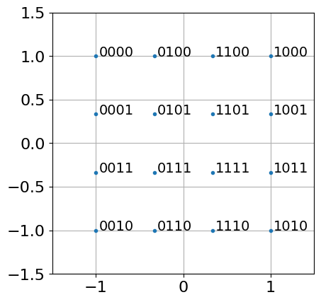

# 16QAM-RX-Homework
Data and description of an assignment to code a 16-QAM receiver, using data received in a POWDER over-the-air measurement experiment

In this assignment, you will modify the QPSK receiver you created in the [QPSK-RX-Tutorial](https://github.com/npatwari/QPSK-RX-Tutorial) to make it into a 16-QAM receiver. You will do the work in a python notebook (on google colab or on your own computer in a Jupyter Notebook).

The input to the activity is from Shout. Your instructor used Shout to transmit and receive a narrowband wireless signal that is 16-QAM modulated. Two nodes were used: cbrssdr1-browning-comp and cbrssdr1-ustar-comp. The sampling rate was 250k samples/sec.

## Background and protocol

The packet included the following structure:
| Part 1 | Part 2 | Part 3 |
| ------ | ------ | ------ |
| Preamble (64 bits) |	Sync Word (16 bits) |	Data (532 bits, or 76 characters each 7 bits) |

For 16 QAM, four bits are converted to one symbol, ie, one complex number, as specified in the constellation diagram. The constellation diagram is specified as part of the wireless digital communication protocol. For us it is

Figure: 16-QAM constellation diagram, showing 16 symbols, each labelled with one of the 16 possible unique 4 bit string. 

The transmitted signal uses the square-root raised cosine pulse shape with parameter alpha=0.5. The pulse vector is 12 symbol periods long, six periods on each side of time=0 (at which the pulse is maximum). 

We generated the 16 square QAM signal in a transmitter script with a string message that you don't know (yet). Then we used Shout to repeatedly transmit and receive the packet, from a specified transmitter and receiver, at approximately the same time. Shout creates several files, including a file with the IQ data received (measurements.hdf5), and a copy of the json file that Shout used. We use a zip of these files in our receiver.

## Instructions

Make a copy of your QPSK receiver that you created in the [QPSK-RX-Tutorial](https://github.com/npatwari/QPSK-RX-Tutorial). 

You will need to change the code to clone this repo, and then to unzip the data zip file: Shout_meas_09-10-2025_11-29-56.zip

Go to this colab python notebook and edit the code to demodulate 16 QAM. There are particular differences you should check and modify code for, described next.

### Constellation

Each possible symbol is encoded with a different hex value, or equivalently, 4 bit sequence. See the constellation diagram figure above for the constellation used in my 16 square QAM transmitter.

Compared to QPSK, you'll note that now, M=16 and k=4, instead of the values for QPSK (M=4, k=2). 

Every place that the code needs to convert from bits to complex (I/Q) symbol values, or vice versa, you'll need to update the code to convert correctly using 16 square QAM. (There are two places in the code that do this.) You might want to test or visualize the inputs and corresponding outputs to make sure they're correct before proceeding, because it's really easy to make a mistake that isn't obvious to the coder.

Note that the first two bits are determined by the x-value (the real part), and the last two bits are decided by the y-value (the imaginary part). It is likely easier to convert the real and imaginary components to bits separately.

### Preamble
Generally, a good preamble alternates symbols on opposite sides of the origin in the constellation diagram. 

For QPSK, we used the bit sequence:

np.repeat( [[1, 1, 0, 0, 1, 1, 0, 0 ]], 8, axis=0)

which corresponds to a symbol sequence of [3, 0, 3, 0, ...]. The "3" symbol is opposite the "0" symbol in QPSK. 

For 16-QAM, I used the following to generate the preamble in the 16-QAM transmitter:

np.repeat( [[1, 0, 0, 0, 0, 0, 1, 0 ]], 8, axis=0)

This corresponds now to a symbol sequence of [8, 2, 8, 2, ...]. These are symbols at 45 degrees and then 225 degrees, in other words, opposite the origin on the complex plane. Also note that although the preamble has the same number of bits, it has half as many symbols. Also note it is the *even* numbered preamble symbols ("8") that are at an angle of 45 degrees, not the *odd* numbered symbols... you need to change the preamble sync to use the even numbered preamble symbols.

### Sync Word

The same sync word bits are used, but again, this translates to half as many symbols.

### Pulse shape

This assignment uses N = 8, alpha = 0.5, and Lp = 6 to form the SRRC pulse shape, the same as in the QPSK assignment.

### Packet length

The number of characters in the message is 76. With 7 bits per character, a 64-bit preamble, a 16-bit synch word, and 4 bits per symbol, the total packet length is 153 symbols, which is called packetLenSymbols.

## Turn in

Run all code through the end of the notebook. At the end, you'll get a string message that will verify (by being nearly readable English words) that you coded the receiver correctly. Your receiver will definitely make some bit errors, and thus character errors, because the SNR is low -- lower than what is necessary for low probability of bit error for 16-QAM.  But you should mostly recognize the English text message.  That's it, that's how you know you've done it correctly!

If you are doing this for class, turn in whatever text you actually receive. Also print your python notebook (as .pdf file), and turn that in. Submission is on canvas.
